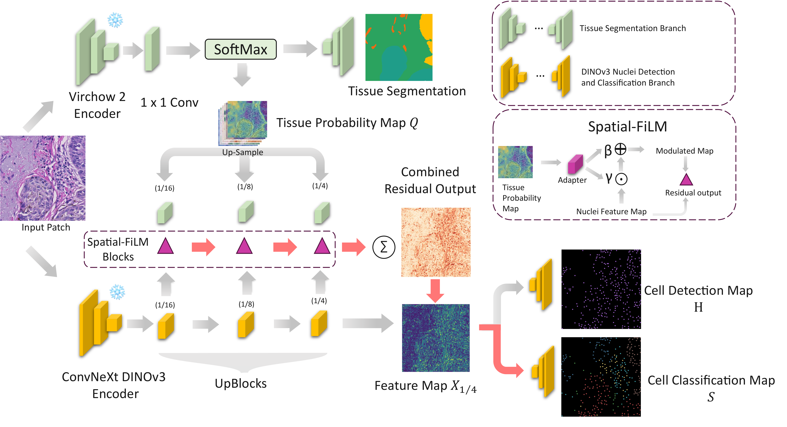

# 可尝试改进

$$
\begin{aligned}
x_{\mathrm{cls}} &= x_{\mathrm{cls}} \\
x_{\mathrm{cls}} &= x_{\mathrm{cls}}
\end{aligned}
$$

$$
x_{cls} = x_{cls}  \\
x_{cls} = x_{cls}
$$

$$
\mathbf{x}_{\text{cls}} =
\mathbf{x}_{1/4}
+
\sum_{s \in \{1/16,\,1/8,\,1/4\}}
\mathbf{P}_s \,\uparrow_s \Delta_s
$$

## 1. 基于点监督的联合细胞检测和分类的任务（tissue 上下文增强）

## 论文信息

- **标题**：Tissue aware nuclei detection and classification model for histopathology images
- **年份**：2025.12
- **作者**：作者1, 作者2
- **会议/期刊**：会议/期刊名称
- **任务类型**：细胞分割分类
- **code**：waiting

## 核心思想
1. 组织上下文增强细胞和分类，多尺度空间线性调制模块
2. dinov3作为基础模型去提取特征
3. 无需完整实例掩码，提出替代实例核分割的方法

  
  

    <em>TAND 模型架构图</em>
  

## Spatial-FiLM多尺度线性调制模块

### 1. 输入特征与组织概率

解码器在尺度 $s \in \{1/16, 1/8, 1/4\}$ 处的特征表示为：

$$
\mathbf{x}_s \in \mathbb{R}^{C_s \times H_s \times W_s}
$$

对应尺度下上采样后的组织类别概率图为：

$$
\mathbf{Q}_s \in \mathbb{R}^{T \times H_s \times W_s}
$$

其中 $C_s$ 表示通道数，$(H_s, W_s)$ 为空间分辨率，$T$ 为组织类型数量。

### 2. Spatial-FiLM 参数生成

Spatial-FiLM 模块通过轻量级卷积适配器 $F_s(\cdot;\theta_s)$ 生成空间可变的仿射调制参数：

$$
[\boldsymbol{\gamma}_s, \boldsymbol{\beta}_s] = F_s(\mathbf{Q}_s; \theta_s),\quad
\boldsymbol{\gamma}_s, \boldsymbol{\beta}_s \in \mathbb{R}^{C_s \times H_s \times W_s}
$$

其中 $F_s$ 为两层卷积网络，隐藏维度为 $h_s$。

### 3. 调制参数约束（稳定训练）

为稳定训练过程，对原始调制参数进行有界化处理：

$$
\tilde{\boldsymbol{\gamma}}_s = \tanh(\boldsymbol{\gamma}_s)\,\eta,\quad
\tilde{\boldsymbol{\beta}}_s = \tanh(\boldsymbol{\beta}_s)\,\frac{\eta}{2}
$$

其中默认缩放系数为：

$$
\eta = 0.5
$$

### 4. FiLM 调制特征

Spatial-FiLM 调制后的特征表示为：

$$
\tilde{\boldsymbol{\gamma}}_s = \tanh(\boldsymbol{\gamma}_s)\,\eta,\quad
\tilde{\boldsymbol{\beta}}_s = \tanh(\boldsymbol{\beta}_s)\,\frac{\eta}{2}
$$

其中 $\odot$ 表示逐元素乘法。

### 5. 调制残差定义

定义尺度 $s$ 处的调制残差为：

$$
\Delta_s = \tilde{\mathbf{x}}_s - \mathbf{x}_s
$$

### 6. 多尺度残差聚合（分类分支）

所有尺度的残差被双线性上采样至 $1/4$ 分辨率，并通过零初始化的 $1 \times 1$ 投影层映射到分类特征空间：

$$
\mathbf{x}_{\text{cls}} =
\mathbf{x}_{1/4}
+
\sum_{s \in \{1/16,\,1/8,\,1/4\}}
\mathbf{P}_s \,\uparrow_s \Delta_s
$$

其中：

* $\uparrow_s$ 表示双线性上采样至 $1/4$ 网格
* $\mathbf{P}_s$ 为 $1 \times 1$ 卷积投影（零初始化）

# 1. 量子增强和适应性损失（应用于跨器官分割数据泛化）

## 论文信息

- **标题**：Breast cell segmentation under extreme data constraints: Quantum enhancement meets adaptive loss stabilization
- **年份**：2025.12
- **作者**：作者1, 作者2
- **会议/期刊**：arxiv
- **任务类型**：乳腺细胞语义分割（0-1分割，没有别的类别，难点在于data里面大部分都不含乳腺，同时含有乳腺的乳腺组织也占比很小）
- **code**：无

## 核心思想
1. 系统优化提高dice（根本没说）
2. 量子集里的边缘增强，利用gabor算子去获得边缘通道，和原本三通道拼接获得四通道，接着利用mlp映射为为三通道，还能接着使用别的模型（倒是以恶个想法，可以试试，加个mlp进去不难）
3. 稳定训练流程？OneCycleLR学习率调度、指数移动平均验证以及数值稳定性保障机制（后面两个没说是啥）
4. 动态组合loss，动态调整loss的权重，避免多损失冲突。（没有具体提到，只说到会根据bs来计算，估计就是四则运算中的一个吧）